# Touchdesigner intro

## Content
* [TouchDesigner ???](#touchdesigner-) 
    * [Inputs and outputs](#Inputs-and-outputs) 
    * [What I do](#What-I-do) 
    * [Interactive stuffs from the digital workshop](#interactive-stuffs-from-the-digital-workshop) 
    * [People doing things](#people-doing-things) 
    * [Interactive stuffs from the digital workshop](#interactive-stuffs-from-the-digital-workshop) 
    * [People doing youtube tutorials](#people-doing-youtube-tutorials) 

* [Understanding TouchDesigner](#understanding-touchdesigner) 
    * [Interface](#Interface) 
    * [Nodes](#nodes) 
    * [Data links](#data-links) 
    * [Quick help!](#quick-help) 

* [Basic actions](#basic-actions) 
    * [Basic `Noise` TOP animation](#basic-noise-top-animation) 
    * [Feedback loop](#feedback-loop) 
    * [Exports](#exports) 
    * [Feedback loop](#feedback-loop) 
    * [Audio-reactive](#audio-reactive) 
    * [Geometry](#geometry) 
    * [Move a circle with the mouse](#move-a-circle-with-the-mouse) 

* [To go further](#to-go-further) 

# TouchDesigner ???

Touchdesigner est un langage de programmation visuelle utilisé pour créer du contenu interactif multimedia en temps réel, beaucoup utilisé par des artistes et des programmeurs pour créer des oeuvres, des performances et des installations.

Touchdesigner permet de créer en 2D et en 3D, avec des outils de rendering et de composition, des sorties et entrées vidéos et audio, de la possiblité de multi-écrans, du vidéo mapping, de l'animation, un moteur 3D, et des outils de programmation.

La programmation dans TD est basée sur la connexion entre différentes nodes, qui ont toutes des paramètres pour contrôler leurs opérations.

Usages types : mapping, VJing, interaction spectacteur/son/

Uses : mapping, VJing, interaction spectacteur/son/environement-visuels

## Entrées et sorties

Entrées :
- sons
- Contrôleur MIDI
- données : OSC, Serial (d'Arduino par exemple)
- etc

Sorties :
- vidéo en temps réel (vidéo-mapping, led-mapping, ...)
- données : OSC, Serial (vers Arduino, ...)
- etc

<!-- ## Lucie Mrc

[@lucie.mrc](https://www.instagram.com/luciemrc/) -->

## Des trucs interactifs à l'ateliernum

*Projection de visuel interactif avec le mur Lidar*

*Calibration de la 3D camera avec Augmenta*

*Pixel mapping avec 9 barres led*

*Pixel mapping avec un controleur MIDI*

## Des gens qui travaillent avec Touchdesigner

[Borischimp504](https://www.instagram.com/borischimp504/) - photogrammetry

[B2bk](https://www.instagram.com/b2bk.fr/) - photogrammetry

[Kaoru Tanaka](https://www.instagram.com/velvet_kaoru/) - generative visuals

[Roelof Knol](https://www.instagram.com/roelofknol/) - interactive installations

[No One's Image](https://www.instagram.com/noonesimg/) - generative visuals

[Karlskene](https://www.instagram.com/karlskene/) - generative visuals with laser and projection

[Simon Alexander-Adams](https://www.instagram.com/polyhop/) - generative visuals

## Des gens qui font des tuto youtube

[Bileam Tschepe](https://www.youtube.com/channel/UCONptu0J1PCrW9YfBtSdqjA)

[The Interactive & Immersive HQ](https://www.youtube.com/channel/UC-9DT8kpvykuBEQ2iVatWbA)

[Acrylicode](https://www.youtube.com/@acrylicode)

[Noto the Talking Ball](https://www.youtube.com/@NotoTheTalkingBall)

[Matthew Ragan](https://www.youtube.com/@raganmd)

[Pakita12](https://www.youtube.com/@paketa12)

[PPPANIK](https://www.youtube.com/channel/UCWBbakpo_cATqJy9Dzf9x4w)

[Grady Sain](https://vimeo.com/user1133243)

# Comprendre TouchDesigner

## Interface

Le réseau de nodes (network) est au milieu, la Palette est sur la gauche (on peux la fermer), les paramètres de la node selectionnée sont à droite.

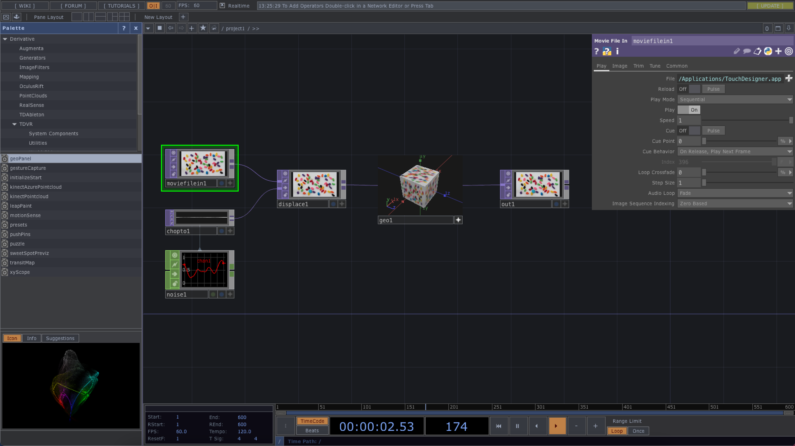

En haut : pleins de petits paramètres de TD, le layout et ainsi de suite, et en bas : la timeline.

## Les nodes

Pour ouvrir le menu des nodes, on peux soit double-cliquer n'importe où sur l'arrière plan, soit presser tab.

Il y a 6 catégories de nodes :
- COMP (Components), des nodes diverses et variées de bases, des contrôles.
- TOP (Texture Operators), pour les opérations sur des images 2D.
- CHOP (Channel Operators), pour l'animation, l'audio, les données.
- SOP (Surface Operators), les objets 3D natifs de TD, manipuler des points 3D, des polygones et des primitifs 3D.
- MAT (Materials), les matériaux et shaders pour les rendus 3D.
- DAT (Data Operators), pour les textes, les scriptes et les bases de données.

 
 Les nodes les + utilisées 

### COMP : 
- `Geo` + `Camera` + `Light` pour créer un rendu 3D.

### TOP : 
- `Noise` : du random en image 2D, facile à animer
- `Composite` :  mélanger plusieurs images avec différents types d'opérations
- `Level` : modifier la luminosité, le contraste, l'opacité, etc d'une image
- `Lookup` + `Ramp` : récoloriser une image suivant un dégradé de couleurs données
- `Movie File In` : charger une image ou une vidéo dans TD
- `Render` : rendre un objet ou une scène 3D dans une image 2D
- `Transform` : modifier la taille d'une image, sa position, son orientation, ajouter un fond derrière les pixels transparents
- `Movie File Out` : exporter une vidéo

### CHOP : 
- `Audio File In` : charger un son dans TD
- `Constant` : créer des données constantes à utiliser dans le projet
- `Filter` : lisser un flux de données pour éviter les sauts trop hauts ou trop bas dans la courbe
- `Limit` : contraindre un flux de données entre un maximum et un minimum selon différentes opérations
- `Math` : appliquer des opérations mathématiques sur des données
- `Mouse In` : récuperer les positions X et Y de la souris
- `Keyboard In` : récuperer les évenements clavier

### SOP : 
- `Grid` : créer une grille 3D
- `Sphere` : créer une sphère
- `Twist` : plier ou twister un objet 3D selon différentes opérations
- `Text` : créer un objet texte en 3D
- `Transform` : modifier la taille, la position et la rotation d'un objet 3D

### MAT : 
- `Constant` : un matériau d'une couleur constante
- `Line` ou `Wireframe` : un matériau avec juste le contour des polygones
- `Phong` : un matériau avec une color map, une normal map, etc

Chaque catégorie de nodes a une couleur, et on ne peux pas connecter des nodes de différentes catégories.
Pour connecter un CHOP à un TOP dans notre network par exemple, il faut soit utiliser un CHOPToTop node ou lier le paramètre choisi dans le CHOP à un paramètre dans le TOP.
Le lien sera une ligne fine grise au lieu d'une ligne pleine de la couleur des nodes : c'est donc un data link.

Chaque node peux être customisé avec une multitude de paramètres particuliers à chaque, et les paramètres peuvent être reliés entre les différentes nodes, pour récuperer des datas de n'importe quel endroit du projet TD.

Pour ouvrir les paramètres, sélectionner une node et presser 'p'.

## Data links

Pour connecter les nodes, on peux soit les relier entre elles depuis la sortie d'une node à l'entrée d'une autre, si elles sont de la même catégories (même couleur).

Pour qu'une node "regarde" une autre node, qu'elles soient de la même catégories (dans un `Feedback` TOP par example) ou non (`CHOP to`, `SOP to`, etc), il suffit de drag and drop la node observée dans la node observante.

On peux aussi drag and drop la node observée (ici : `Audio Oscillator` CHOP) dans l'encart dans les paramètres de la node observante (ici : `CHOP to` TOP), ou d'y écrire son nom. Il y a donc un data link entre les deux nodes.

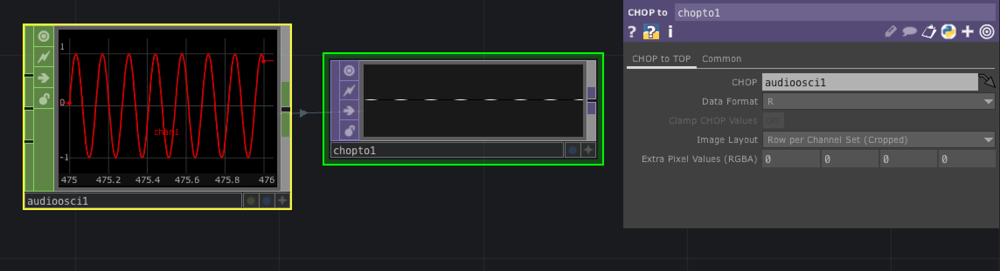

Pour récupèrer les données d'une node (la plupart du temps, d'une CHOP) dans les paramètres d'une autre node, il faut d'abord cliquer sur le petit + en bas à droite de la node, pour activer le mode "Viewer Active".

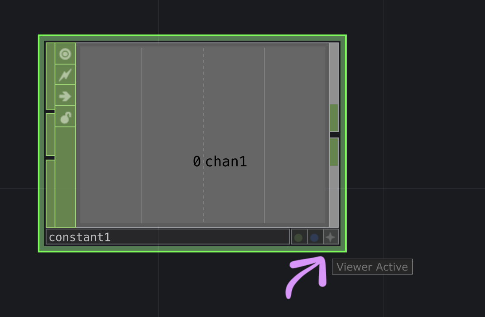

L'apparence de la node devrait changer, et on peux alors drag and drop le nom du channel de donnée dans un encart des paramètres d'une autre node.
Ici le channel chan1 d'un `Audio Oscillator` CHOP, dans le paramètre 'period' d'un `Noise` TOP.
Une liste d'options d'export apparaît et on sélectionne "CHOP Reference" pour récuperer les données en temps réel.

On peux aussi écrire "op('NomDeLaNode')['NomDuChannel']" dans le paramètre.

On voit le data link en gris entre les deux nodes.

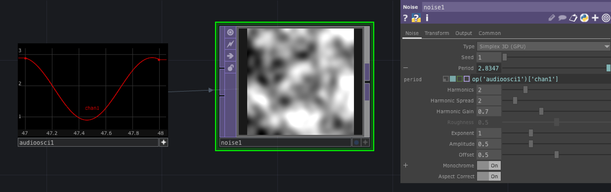

## Aide rapide

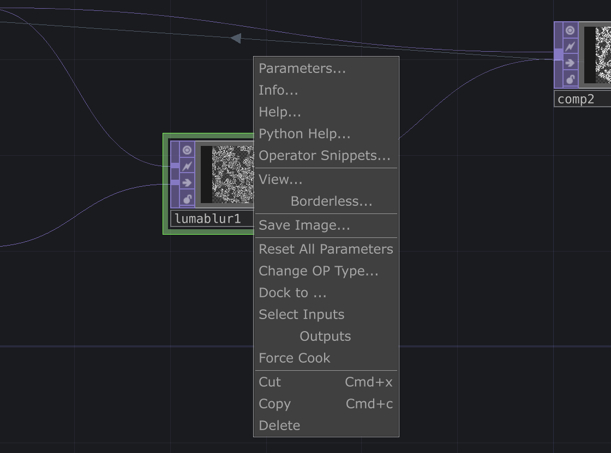

Pour avoir de l'aide rapidement pour une node qu'on ne connaît pas ou qu'on ne comprend pas, on peux clique-droit sur la node et choisir sur `Operator Snippets` pour ouvrir une page Touchdesigner avec un ou plusieurs exemples de l'utilisation de la node :

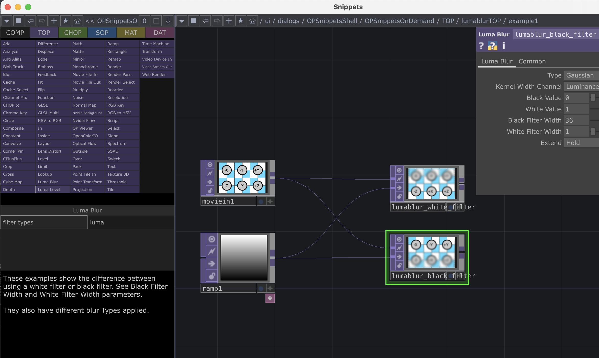

On peux aussi choisir `Help` pour ouvrir la page de la documentation de la node :

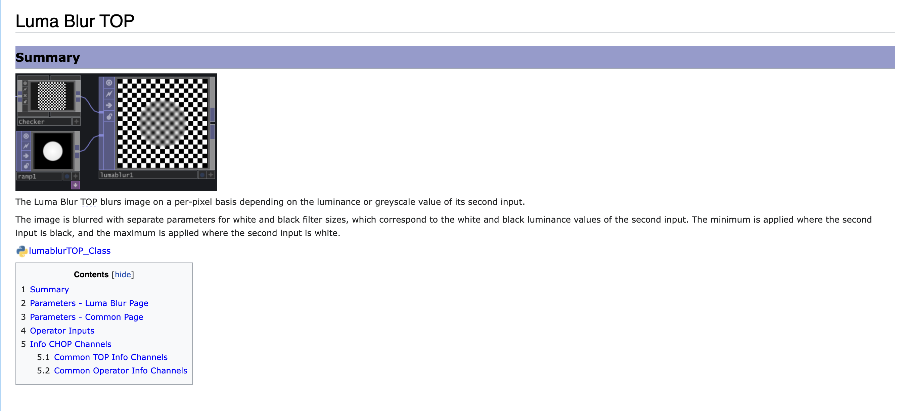

# Actions de base

## Animation du `Noise` TOP

Pour animer un `Noise` TOP, on peux écrire "absTime.seconds" dans les paramètres Translate de l'onglet Transform des paramètres du Noise.

On peux donc faire en sorte que le noise défile horizontalement avec translate X, défile verticalement avec translate Y, et les animations les plus intéressantes sont souvent avec translate Z.

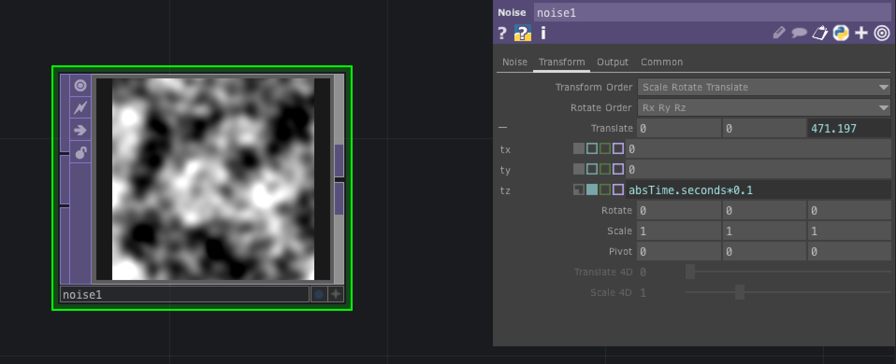

## Feedback loop

Le feedback loop de base : un TOP de texture, qui va dans `Feedback` TOP, qui va dans un TOP de modifiction TOP (level, blur, etc), qui va dans un `Composite` TOP avec le TOP initial.

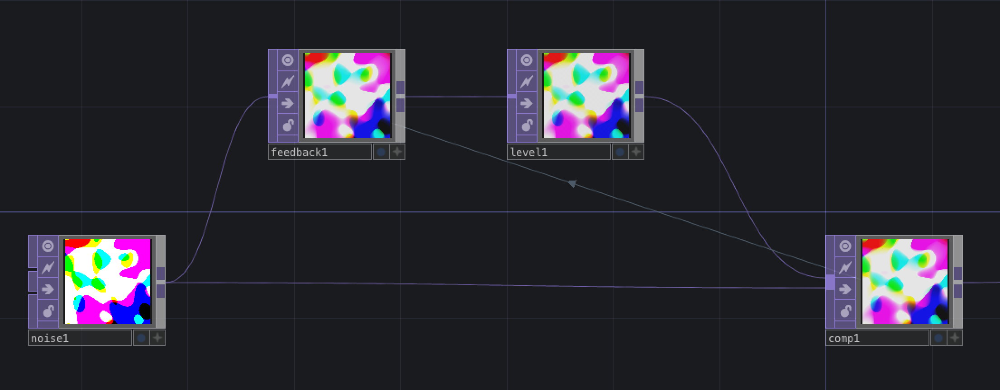

Dans l'encart "Target" des paramètres du `Feedback` TOP, on drag and drop le `Composite` TOP, pour avoir un data link entre les TOPs qui ferme la boucle.

Dans les paramètres du `Level` TOP, dans l'onglet Post, on met une opacité inférieur à 1 (.9 par exemple), pour baisser l'opacité des layers de l'image au fur et à mesure qu'ils passent dans la feedback loop.

Dans les paramètres du `Composite` TOP, on peux choisir un mode d'opération comme Add, ou Atop.

Mon tutoriel sur [comment ça marche les feedback loops](https://github.com/LucieMrc/TD_feedback_love_EN).

## Exporter

Pour exporter une vidéo en .mov : créer un `Movie File Out` TOP à la toute fin du network, choisir un nom et une dossier d'enregistrement pour le fichier dans l'encart "File". Pour commencer à enregistrer, il suffit d'acord le bouton "Record" dans les paramètres et le désactiver pour arrêter d'enregistrer.

Il faut décocher le bouton "Realtime" au milieu du menu en haut, pour que la vidéo ne perdent pas en qualité si Touchdesigner lag un peu.

Pour envoyer la vidéo sur un media server en temps réel, il faut créer un `Syphon/Spout Out` TOP à la toute fin du network. On peux ainsi récuperer la vidéo dans Madmapper par exemple.

## Audio-reactif

Créer un `Audio File in` CHOP, et activer si besoin le bouton "Mono" dans les paramètres pour avoir un seul channel au lieu d'un son stereo à deux channels.

On peux charger son propre son ou garder celui d'exemple de TD.

Le lier à un `Math` CHOP, aller dans l'onglet "Range" des paramètres, et changer d'abord les paramètres de "From Range". Je mets ici -0.7 et 0.7 parce que c'est le minimum et le maximum que je vois sur mon CHOP.

Puis changer le "To Range", je mets ici 0.2 et 0.3 parce que ça rendait le mieux.

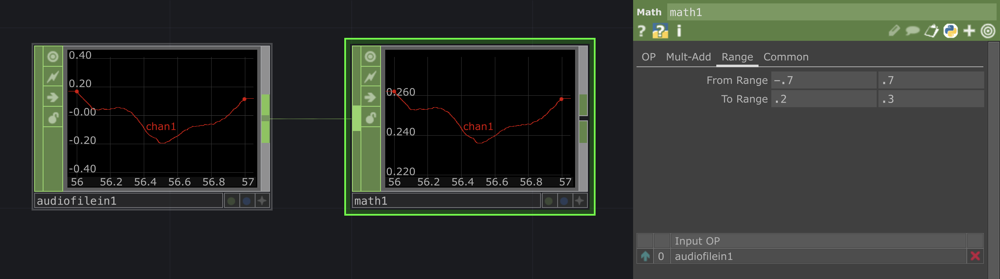

Cliquer sur le petit + en bas à droite du node pour activer le Viewer Active.

Créer un `Circle` TOP, et dans les paramètres "Radius" X et Y, drag and drop le chan1 du `Math` TOP, et sélectionner CHOP Reference pour voir apparaitre le data link.

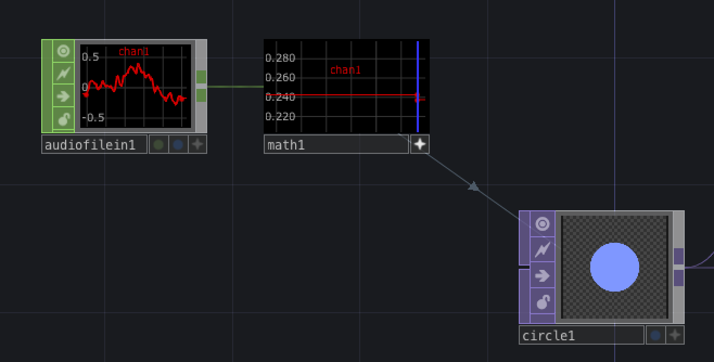

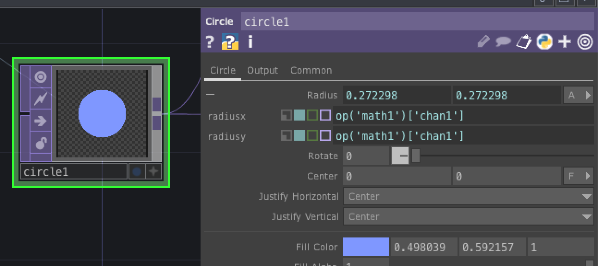

Le diamètre du rond bouge maintenant en fonction du son

## Créer un rendu 3D

Pour créer un network de rendu 3D de base, il faut 5 nodes :

- un objet SOP
- un `Geometry` COMP
- un `Camera` COMP
- un `Light` COMP
- un `Render` TOP
- un MAT

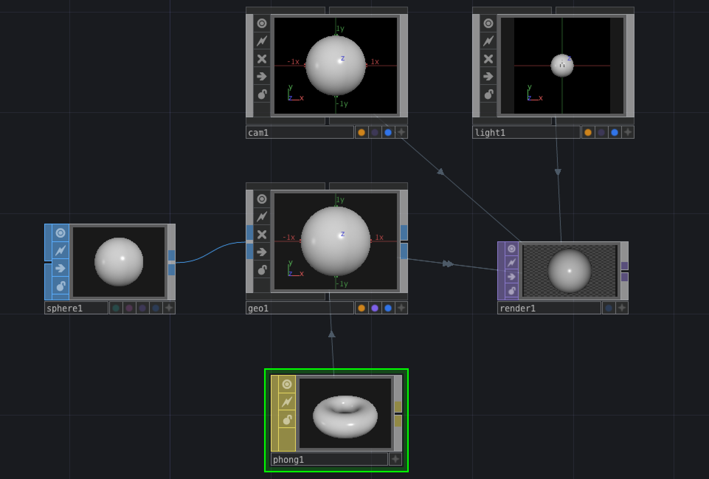

On commence par créer un objet SOP de notre choix, ici un `Sphere` SOP.

Créer un `Geometry` COMP en tirant un fil de la sortie de la `Sphere` et en pressant tab.

La sphere devrait apparaitre dans le `Geometry`. Créer un `Camera` COMP et un `Light` COMP, puis un `Render` TOP, et des data links devraient apparaitre entre les trois COMP et le `Render`.

Puis créer un MAT (ici un `Phong` MAT), et le drag and drop sur le `Geometry`, puis choisir "Parm: Material".

### Créer un matériau 3D à partir d'une image 2D

Avec le `Phong` MAT, on peux utiliser n'importer quel TOP comme texture pour le matériau en drag and drop le TOP sur la "Color Map" dans les paramètres du `Phong`.

## Bouger un cercle avec la souris

Create a `Mouse In` CHOP.

Create a `Circle` TOP, set the radius to something smaller like 0.05, and the resolution to something bigger like 1280*720.

Connect it to a `Transform` TOP.

In the `Transform` TOP parameters, drag and drop "tx" from the `Mouse In` CHOP in the Translate X parameter, and do the same for "ty".

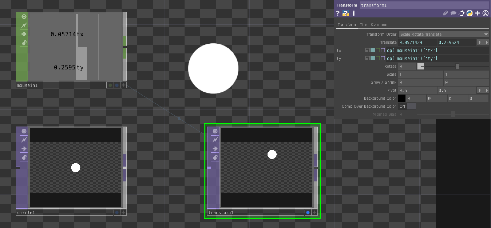

If the circle isn't matching exactly the position of the cursor, we can remap the position so it matches the resolution of the image.

Add two `Select` CHOP after the `Mouse In`, and choose tx and ty in "Channel Names" in each `Select`, to have a CHOP for each channel.

Add a `Math` CHOP after each `Select` and go to the "Range" tab of the parameters.

Most of the time, the position tx of the mouse will go from -1 (left side of the screen) to 1 (right side), and ty will go from around -0.6 (bottom of the screen) to 0.6 (top of the screen). You want to "From Range" to be these values in each `Math` CHOP.

You can then arrange the "To Range" value by moving your mouse to the edges of the display of the `Transform` TOP, and setting the range to a value where the circle center position match your cursor position around the edges and in the middle of the display.
I used -0.6, 0.6 for tx and -0.7, 0.7 for ty.

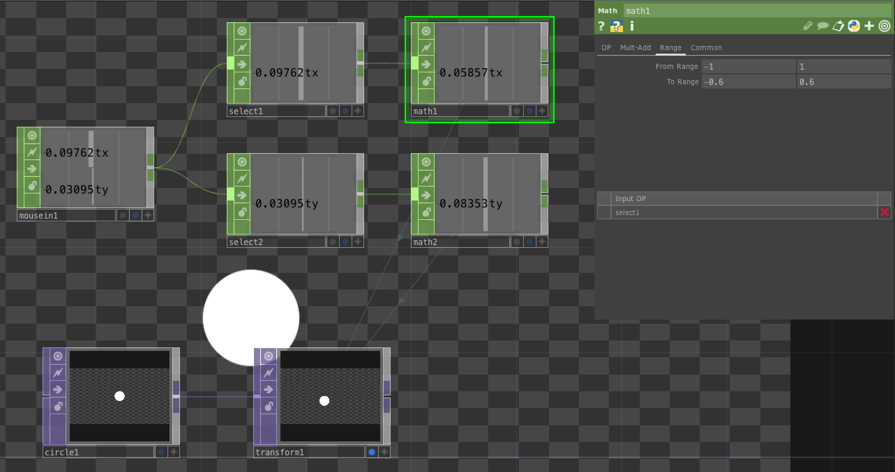

The Range tab in a `Math` CHOP works by giving the current minimum and maximum of a value, and the new minimum and maximum that you chose, so the value is recalculated proportionally.

# To go further

- [Audioreactive visual in TD (EN)](https://github.com/LucieMrc/TD_audioreact_love_EN)

- [Feedback loop in TD (EN)](https://github.com/LucieMrc/TD_feedback_love_EN)

- [Using Kantan for video-mapping in TD (EN)](https://github.com/LucieMrc/TD_KantanMapper)

- [Photogrammetry in TD (FR for now)](https://github.com/LucieMrc/Photogrammetrie)

- [Using Augmenta with TD (EN)](https://github.com/LucieMrc/TD_Augmenta)

- [Touchdesigner ressources from the MIR lab](https://mir.works/learning-resources) (advanced)# IntroTD_FR
